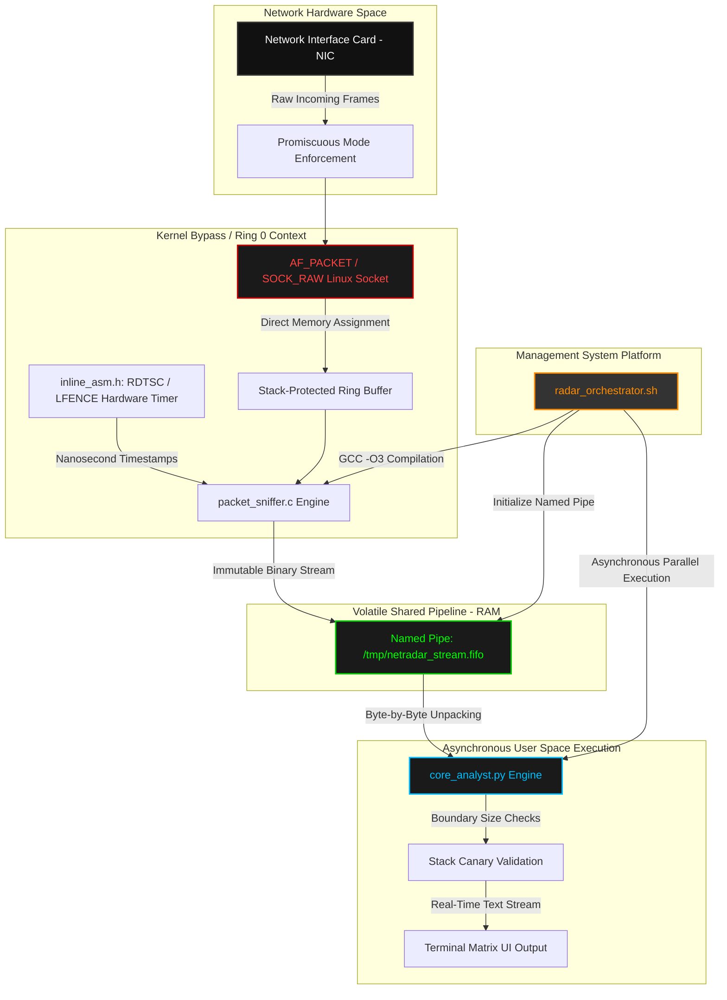

# Technical Blueprint: Boutaba NetRadar Suite (v3.0)

**Chief Architect:** Motezeballah Boutaba
**Target Architecture:** POSIX-Compliant Microarchitecture (Arch Linux Optimized)
**Design Paradigm:** Asynchronous Parallel Pipeline Architecture with Kernel-Bypass Memory Abstractions

---

## 📐 1. System Architecture & Component Mapping

The system architecture is engineered as a decoupled, multi-engine runtime environment designed to partition data collection from logical telemetry analysis. The entire workflow executes in volatile memory spaces (RAM), utilizing named pipes (FIFO) to enforce deterministic boundaries and achieve maximum processing throughput with zero disk-write operations.

---

## 🔬 2. Deep-Dive Subsystem Specifications

### Part 1: Hardware Core Engine (`src/packet_sniffer.c`)
- **Execution Level:** Operational at Link-Layer privilege boundaries via `AF_PACKET` mapping.
- **Data Capture Matrix:** Intercepts raw Ethernet structures directly from the network driver queue, avoiding standard network stack encapsulation overhead.
- **Input/Output Binding:** Serializes incoming frame sizes into explicit `ssize_t` structures, prepending the raw buffer chunk and flushing it instantly to `stdout` via memory blocks.

### Part 2: Nanosecond Timestamp Bindings (`src/inline_asm.h`)
- **Instruction Level Execution:** Implements strict hardware serialization utilizing `lfence` memory barriers to eliminate Out-of-Order processor pipeline execution.
- **Telemetry Auditing:** Captures the CPU Time Stamp Counter via low-level `rdtsc` registry readings, allowing for nanosecond-precise evaluation of system packet latency.

### Part 3: Asynchronous Logic Analyst (`src/core_analyst.py`)
- **Threading Engine:** Leverages single-threaded, non-blocking asynchronous event loops to manage memory IO without context-switching exhaustion.
- **Dissection Mechanics:** Unpacks the network stream sequentially using exact binary structures (`struct.unpack`). It evaluates protocol headers (`Ethernet/IPv4`) and logs metrics directly to the interface.
- **Boundary Verification Safety:** Enforces rigid input length constraints (0 < packet_size <= 65536 bytes) to neutralize buffer overflow or corrupted stream injection vulnerabilities.

### Part 4: System Master Orchestrator (`radar_orchestrator.sh`)
- **Environment Automation:** Programs the volatile shared pipeline boundaries by spawning an explicit `/tmp/netradar_stream.fifo` file in temporary memory.
- **Automated Compilation Toolchain:** Compiles the underlying hardware source code dynamically using `gcc -O3` optimization configurations.
- **Lifecycle Integration:** Monitors thread PIDs and registers clean termination signals (`SIGINT/SIGTERM`) to flush memory allocations automatically upon exit.

---

## ⚖ 3. Compliance Framework & Verification Matrix

All variables, volatile allocations, and data streams reside strictly inside transient heap structures. Unauthorized deployment against external networks or multi-tenant architectures without local administrative authorization remains non-compliant under standard engineering framework protocols.

---
